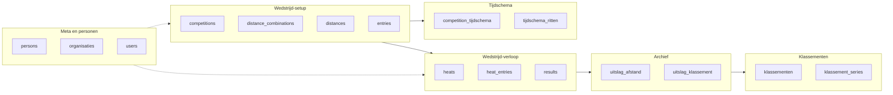
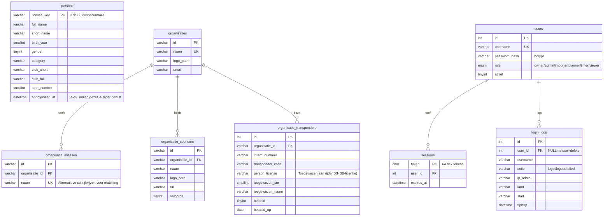
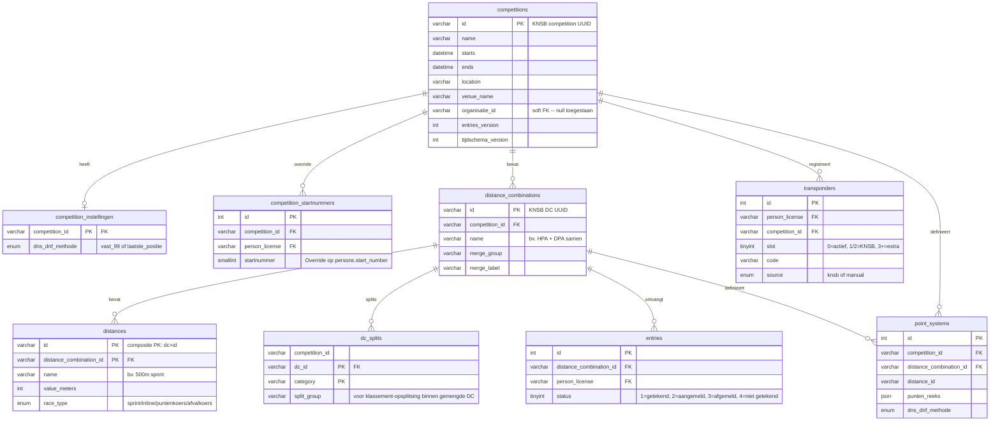
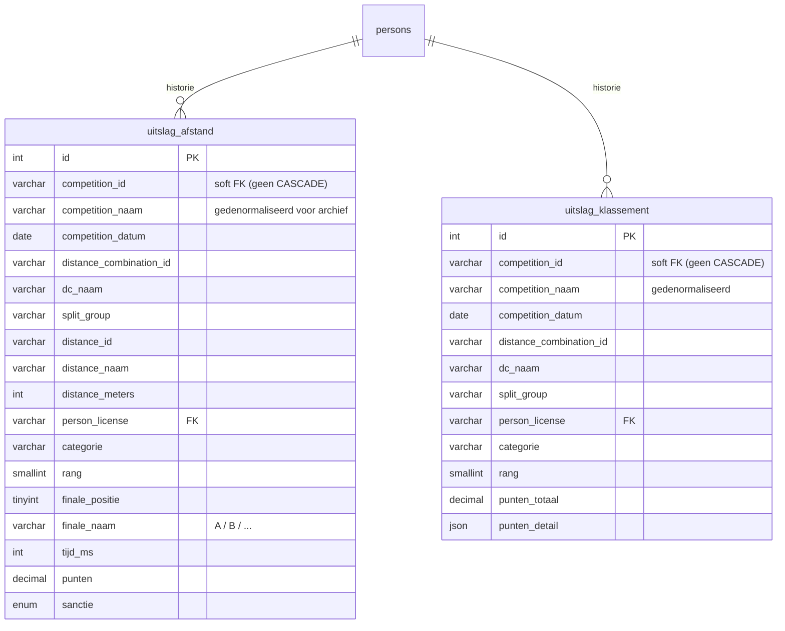
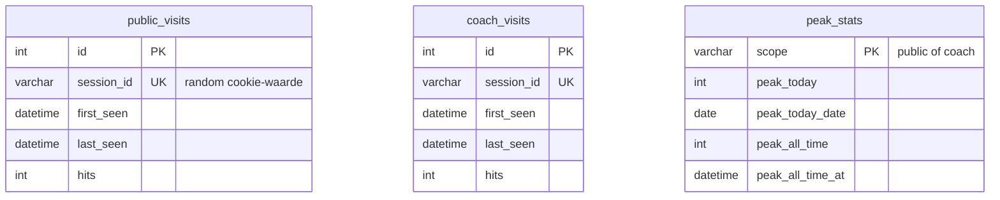

# InlineComp — Database-schema

Grafisch overzicht van alle 37 tabellen en hun onderlinge relaties, opgesplitst
per logisch domein zodat het leesbaar blijft. De diagrammen zijn geschreven in
[Mermaid](https://mermaid.js.org/) en renderen automatisch in:

- GitHub / GitLab (gewoon in de browser openen)
- VS Code met de **Markdown Preview Mermaid Support**-extensie (`Ctrl+Shift+V`)
- Pandoc → HTML/PDF met de juiste filter

Zie `db/*.sql` voor de complete `CREATE TABLE`-statements per tabel.

---

## 0. Overzicht op hoofdlijnen

Zes logische domeinen, met de belangrijkste kruisverbanden:



---

## 1. Meta en personen

Stabiele data die over meerdere wedstrijden relevant is: rijders, organisaties,
gebruikers van InlineComp.



---

## 2. Wedstrijd-setup

Alles dat vóór de wedstrijddag vastligt: de wedstrijd zelf, welke categoriën,
welke afstanden, wie is ingeschreven.



---

## 3. Tijdschema en programma

Het tijdschema per wedstrijd met blokken (programma-onderdelen) en ritten
(concrete heats met hun starttijd). Dit wordt ruim vóór de wedstrijd opgesteld.

```mermaid
erDiagram
    competition_tijdschema {
        int id PK
        varchar competition_id FK UK
        enum systeem "full-final / internationaal-nieuw"
        enum status "concept / gepubliceerd"
        datetime gegenereerd_op
    }

    tijdschema_blokken {
        int id PK
        int tijdschema_id FK
        smallint volgorde
        enum blok_type "ronde/pauze/inrijden/wedstrijdstart/ceremonie/herstart"
        varchar afstand_naam
        enum ronde_type "heats/kwartfinale/halve_finale/runner_up/finale"
        smallint duur
        time tijdstip
    }

    tijdschema_afstand_config {
        int id PK
        int tijdschema_id FK
        varchar afstand_naam UK
        tinyint finale_heat_grootte
        tinyint finale_b_grootte
        enum finale_seeding "slang / tijdkoppeling"
        enum race_type "sprint / long_distance"
        enum heats_ranking
        enum kwart_ranking
        enum half_ranking
        enum finale_ranking
    }

    tijdschema_cat_config {
        int id PK
        int tijdschema_id FK
        varchar dc_id FK
        varchar distance_id
        tinyint heeft_heats
        tinyint heats_aantal
        smallint heats_q
        tinyint heeft_kwartfinale
        tinyint heeft_halve_finale
        tinyint finale_heats
        tinyint finale_a_grootte
    }

    tijdschema_ritten {
        int id PK
        int tijdschema_id FK
        int blok_id FK
        smallint volgorde
        time tijdstip_override
        varchar dc_id FK
        varchar distance_id
        enum ronde_type
        tinyint heat_nr
        varchar rit_naam
        tinyint verwacht
    }

    competition_tijdschema ||--o{ tijdschema_blokken         : programma
    competition_tijdschema ||--o{ tijdschema_afstand_config  : per-afstand
    competition_tijdschema ||--o{ tijdschema_cat_config      : per-categorie
    competition_tijdschema ||--o{ tijdschema_ritten          : ritten
    tijdschema_blokken     ||--o{ tijdschema_ritten          : bevat
```

---

## 4. Wedstrijd-verloop (live)

Wordt ingevuld op de wedstrijddag zelf. `heats` ontstaat ronde-voor-ronde,
gekoppeld aan een vooraf gedefinieerde `tijdschema_ritten`-slot.

```mermaid
erDiagram
    heats {
        int id PK
        varchar competition_id FK
        varchar distance_combination_id FK
        varchar distance_id
        varchar split_group
        tinyint ronde "1=series, 2=KF, 3=HF, 4=finale"
        int tijdschema_rit_id FK "via welk rit-slot"
        smallint rit_volgorde
        varchar heat_naam
        tinyint heat_nr
        datetime geplande_starttijd
        varchar race_type
    }

    heat_entries {
        int id PK
        int heat_id FK
        varchar person_license FK
        varchar categorie
        tinyint startpositie UK "per heat"
        smallint startnummer
    }

    results {
        int id PK
        int heat_entry_id FK UK
        tinyint finishpositie
        int tijd_ms "in ms"
        enum sanctie "W1/W2/FS/RR/DQ-TF/DQ-SF/DQ-DF/DNS/DNF"
        smallint rondes "voor lange afstand/puntenkoers"
        decimal punten
        varchar notitie
    }

    heats        ||--o{ heat_entries : startlijst
    heat_entries ||--o| results      : uitslag
```

Externe verbanden (FK's naar andere domeinen):
- `heats.competition_id` → `competitions`
- `heats.distance_combination_id` → `distance_combinations`
- `heats.tijdschema_rit_id` → `tijdschema_ritten`
- `heat_entries.person_license` → `persons`

---

## 5. Archief (uitslagen)

Gedenormaliseerd, zodat een wedstrijd verwijderd kan worden zonder de
historische uitslagen te verliezen. **Bewust géén FK naar competitions.**



---

## 6. Klassementen en series

Meerdaagse of seizoensklassementen. `klassementen` is de "container" (zowel
voor PDF-imports als voor serie-klassementen). Voor series bouwt
`klassement_series` daarop voort.

```mermaid
erDiagram
    klassementen {
        varchar id PK
        varchar naam
        varchar seizoen
        varchar bron_bestand "PDF-bestandsnaam bij import"
        json categorieen
        json wedstrijden_meta
        int totaal_rijders
        varchar org_id "soft FK"
    }

    klassement_posities {
        varchar id PK
        varchar klassement_id FK
        int positie
        varchar start_number
        varchar license_key "soft link naar persons"
        varchar naam
        varchar categorie
        json punten_detail "per-wedstrijd punten"
        decimal punten_totaal
    }

    klassement_series {
        varchar id PK
        varchar klassement_id FK UK "1-1 met klassementen"
        varchar naam
        varchar seizoen
        varchar org_id "soft FK"
        json regels "type, afstand_filter, punten_tabel, ..."
        datetime herberekend_op
    }

    klassement_serie_wedstrijden {
        varchar serie_id PK "FK"
        varchar competition_id PK "GEEN FK -- KNSB-UUID kan zonder import"
        tinyint telt_mee
        tinyint is_finale
        smallint volgorde
        varchar comp_naam "fallback als comp niet geimporteerd"
        datetime comp_datum
    }

    klassement_presets {
        varchar id PK
        varchar org_id "NULL = globale preset"
        varchar naam "bv. KNSB tabel 2026"
        json regels
    }

    series {
        int id PK
        varchar naam
        varchar seizoen
        varchar discipline
    }

    series_wedstrijden {
        int series_id PK "FK"
        varchar competition_id PK "FK"
        tinyint volgorde
    }

    klassementen      ||--o{ klassement_posities          : posities
    klassementen      ||--|| klassement_series            : "als serie"
    klassement_series ||--o{ klassement_serie_wedstrijden : wedstrijden
    series            ||--o{ series_wedstrijden           : koppelt
```

---

## 7. Bezoek-statistieken

Anonieme telling voor het dashboard in Beheer → Gebruikers. Géén IP-opslag,
géén tracking-cookies — alleen geaggregeerde sessie-teltekens.



Geen onderlinge FK's; `peak_stats` wordt afgeleid uit de twee andere tabellen
door periodiek een query te draaien.

---

## Legenda

- **FK** — foreign key (harde verwijzing, meestal met `ON DELETE CASCADE`)
- **UK** — unique key
- **PK** — primary key (of onderdeel van een composite PK)
- **soft FK** — verwijzing die geen database-constraint heeft (bewust, bv. om
  KNSB-UUIDs op te slaan zonder een rij in `competitions` te vereisen, of om
  archieven te behouden na wedstrijd-verwijdering)

## Renderen naar een plaatje

Voor in een presentatie o.i.d. een PNG/SVG genereren van dit bestand:

```bash
# Installeer éénmalig mermaid-cli (heb je Node al)
npm install -g @mermaid-js/mermaid-cli

# Genereer een SVG van één diagram (via een klein PS/Bash-knipsel)
mmdc -i docs/database-schema.md -o docs/database-schema.png
```

Of bekijk het bestand in GitHub / VS Code — daar renderen ze direct.
